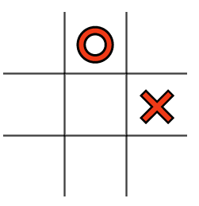

# DOM project

En aquesta activitat crearàs un joc el DOM, HTML i CSS.

## Objectius

- Manipular el DOM directament, afegint i eliminant elements.
- Fer servir CSS per donar estils als elements de la pàgina.
- Afegir gestors d'esdeveniments (event handlers) per interactuar amb les accions que l'usuari faci a la pàgina.
- Gestionar les dades del joc de manera ordenada i estructurada, separades de la visualització
- Implementar la lògica de funcionament del joc de manera ordenada i estructurada, dividint el codi en tantes funcions com calgui.
- Separar la lògica de funcionament del codi de la visualització.

## Configuració

- `npm install` per instal·lar Tailwind CSS.
- `npm start` per a inicialitzar el compilador de Tailwind CSS.
- Obre `index.html` al navegador amb el Live Server de VS Code.

## Basic requirements

- Escull un dels següents jocs i desenvolupa'l utilitzant tot el que has après de HTML, CSS, JavaScript i el DOM.
- Si ho prefereixes, pots fer un altre joc que no estigui en aquesta llista
- You should create the grid for the tic tac toe in `HTML`
- You should style to be the max similar as possible to the image `pas3.PNG`
- You should use JavaScript to display "x" and "o" on the grid.

### Tres en ratlla

### 1. Primera Part

- [ ] Afegiu l'HTML necessari

  - Haurieu de crear el `<div>` necessari pel comptador.

- [ ] Afegiu el CSS necessari:

  - El comptador ha d'estar centrat a la pàgina.
  - Traieu els costats innecessaris. 
  - Feu-ho el més semblant possible a un taulell de tres en ratlla.

  

- [ ] Afegiu contingut

  - Utilitzeu pseudoelements per afegir X's i O's als quadres
  - Al vostre arxiu Css, afegiu el següent:

    ```css
    .x::after {
      content: "?";
    }
    .o::after {
      content: "?";
    }
    ```

    Ara, reemplacem "?" pels icones "❌" i "⭕" tal com es veu a la imatge de sota.


    

    ```css
    .x::after {
      content: "❌";
    }
    .o::after {
      content: "⭕";
    }
    ```

    El fragment de codi CSS anterior significa que cada vegada que apliquem una classe de .x o .o a una de les cel·les, es marcarà.
    
    
- [ ] Centreu els icones ❌ i ⭕

  - Afegiu l'estil CSS per tal que els elements estiguin centralitzats i més grans.

    

  - [ ] Comproveu que el vostre `CSS` estigui funcionant correctament
        

### 2. Afegeix funcionalitat

Recordatori: Tota la interactivitat i les funcionalitats haurán d'estar fetes utilitzant funcions de JavaScript.

- [ ] Feu que el vostre joc s'assembli a la imatge inferior.

  - Programeu un esdeveniment de clic al grid per marcar les caselles
  - Afegiu els checks necessaris (draw, winner)
  - Afegiu CSS per desactivar la cel·la després del clic


- Creeu un botó <button>restart</button> amb HTML
- Feu que el botó de reinici sigui funcional.

- [ ] Creeu el joc

 Ara centrem la nostra atenció a crear realment el joc en si. Tenim el tauler, tenim l'estil i ara afegirem la lògica. En primer lloc, volem definir un objecte per emmagatzemar l'state del nostre joc:

  ```js const game = {
      xTurn: true,
      xState: [],
      oState: [],
      winningStates: [
          // Rows
          ['0', '1', '2'],
          ['3', '4', '5'],
          ['6', '7', '8'],

          // Columns
          ['0', '3', '6'],
          ['1', '4', '7'],
          ['2', '5', '8'],

          // Diagonal
          ['0', '4', '8'],
          ['2', '4', '6']
      ]
  }
  ```

Aquest objecte tindrà 4 propietats diferents:

1. `xTurn`, una bandera per intercanviar torns.
2. `xState`, l'estat de la X, representat amb un array d'strings.
3. `oState`, l'estat de la Y, representat de la mateixa manera.
4. `winningStates`, les possibles combinacions per guanyar el joc.

Com hem aconseguit les possibles combinacions? A partir d'aquests valors, podem enumerar els possibles estats guanyadors aquí. Compararem això amb `xState` i `oState` més endavant per veure qui està guanyant el joc.

### 3. Doneu-li estil a la pantalla "final del joc".


- Creeu una etiqueta de titol HTML `h1` i afegiu al vostre codi els resultats possibles en funció de les coincidències.
- Assegureu-vos que el botó de reset apareix al final del joc.

## Recursos

- [How to Recreate Tic-Tac-Toe in Vanilla JavaScript](https://www.webtips.dev/tic-tac-toe-in-javascript)
- [MDN - Manipulating the DOM Guide](https://developer.mozilla.org/en-US/docs/Learn/JavaScript/Client-side_web_APIs/Manipulating_documents)
- [Plain JS - Common DOM Manipulation methods](https://plainjs.com/javascript/manipulation/)
- [Eloquent JavaScript - The DOM](https://eloquentjavascript.net/14_dom.html)
- [Eloquent JavaScript - Handling Events](https://eloquentjavascript.net/15_event.html)

## Notes

_Aquest és un projecte d'estudiant creat a [CodeOp](http://CodeOp.tech), al bootcamp de Front End Development a Barcelona._
